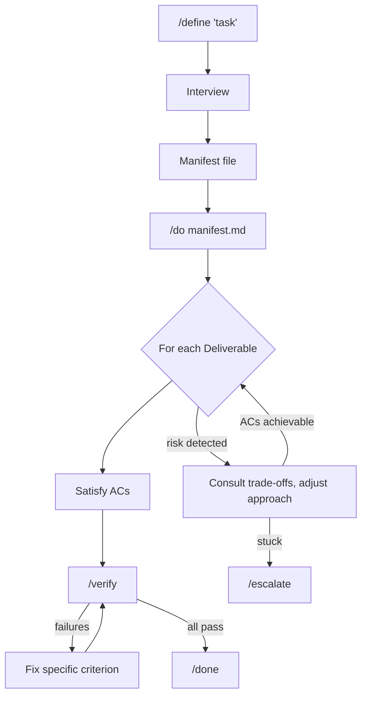

<p align="center">
  <picture>
    
  </picture>
</p>

# Manifest-Driven Development

Stop iterating with the model after implementation. Define what you'd accept, run two commands, ship it.

## Quick Start

```bash
# Claude Code (primary)
/plugin marketplace add doodledood/manifest-dev
/plugin install manifest-dev@manifest-dev-marketplace

# Gemini CLI — everything (skills, agents, hooks)
curl -fsSL https://raw.githubusercontent.com/doodledood/manifest-dev/main/dist/gemini/install.sh | bash

# OpenCode — everything (skills, agents, commands, plugin)
curl -fsSL https://raw.githubusercontent.com/doodledood/manifest-dev/main/dist/opencode/install.sh | bash

# Codex CLI — everything (skills, TOML stubs, rules, config)
curl -fsSL https://raw.githubusercontent.com/doodledood/manifest-dev/main/dist/codex/install.sh | bash
```

Then use it:
```bash
# Define what to build, then execute
/define <what you want to build>
/do <manifest-path>

# Or go end-to-end autonomously:
/auto <what you want to build>

# Optional: understand something deeply before acting
/understand <topic or problem>
```

`/define` interviews you and builds a manifest. `/do` executes it. `/auto` chains both — define autonomously, auto-approve, execute — in a single command. `/understand` is optional — a truth-convergent thinking partner for when understanding IS the goal, or before `/define` when the problem space is foggy.

Control interview depth with `--interview minimal|autonomous|thorough|collaborative` (default: thorough). Thorough asks everything. Minimal asks scope and high-impact items. Autonomous builds the manifest without asking, presents it for approval.

If you use zsh and want easy upgrade commands for the non-Claude distributions, add this to `~/.zshrc`:

```zsh
alias upgrade-manifest-dev-codex='curl -fsSL https://raw.githubusercontent.com/doodledood/manifest-dev/main/dist/codex/install.sh | bash'
alias upgrade-manifest-dev-gemini='curl -fsSL https://raw.githubusercontent.com/doodledood/manifest-dev/main/dist/gemini/install.sh | bash'
alias upgrade-manifest-dev-opencode='curl -fsSL https://raw.githubusercontent.com/doodledood/manifest-dev/main/dist/opencode/install.sh | bash'
alias upgrade-manifest-dev-all='upgrade-manifest-dev-codex && upgrade-manifest-dev-gemini && upgrade-manifest-dev-opencode'
```

Then run `source ~/.zshrc` once. Future updates are just `upgrade-manifest-dev-codex`, `upgrade-manifest-dev-gemini`, `upgrade-manifest-dev-opencode`, or `upgrade-manifest-dev-all` for all three.

Uninstall uses the same entrypoints:

```bash
curl -fsSL https://raw.githubusercontent.com/doodledood/manifest-dev/main/dist/gemini/install.sh | bash -s -- uninstall
curl -fsSL https://raw.githubusercontent.com/doodledood/manifest-dev/main/dist/opencode/install.sh | bash -s -- uninstall
curl -fsSL https://raw.githubusercontent.com/doodledood/manifest-dev/main/dist/codex/install.sh | bash -s -- uninstall
```

## The Mindset Shift

Instead of telling the AI *how* to build something, you tell it what you'd accept.

Say you need a login page. The old way: "use React Hook Form, validate with Zod, show inline errors, disable the button while submitting." You've made every design decision upfront. The manifest way: "invalid credentials show an error without clearing the password field" and "the form can't be submitted twice." You define the bar. The AI picks how to clear it. Automated verification confirms it did.

## How It Works



`/define` interviews you to surface what you actually want. The stuff you'd reject in a PR but wouldn't think to specify upfront. Then `/do` implements toward those acceptance criteria, flexible on *how* but not on *what*.

After each deliverable, `/verify` runs automated checks against every criterion. Failing checks say exactly what's wrong. The AI fixes what failed, only what failed, and the loop continues until everything passes or a blocker needs your attention.

## What Changes

Your first pass lands closer to done. Issues get caught by verification before you see them, and the fix loop handles cleanup without your involvement. Every acceptance criterion has been verified, and you know what was checked.

While one manifest executes, you can define the next. The define phase is where your judgment matters; the do-verify-fix phase runs on its own. Writing acceptance criteria also forces you to stay engaged with your own code, which matters when heavy AI usage starts making your codebase feel foreign.

Resist the urge to intervene during `/do`. It won't nail everything on the first pass. That's expected. You invested in define; let the loop run.

## Who This Is For

If you've burned out on the weekly "game-changing AI coding tool" cycle and just want something that works, this is for you. Experienced developers who care more about output quality than execution speed. People who've learned the hard way that AI-generated code needs guardrails more than cheerleading.

We build around how LLMs actually work, not how we wish they worked. That means investing upfront for better results, not optimizing for token cost or raw speed. If you're counting every cent per token or want the fastest possible output regardless of quality, this probably isn't your thing.

---

Everything below is reference. You don't need any of it to get started.

---

## Going Deeper

<details>
<summary><strong>The problem this solves</strong></summary>

You plan a feature with the agent. It implements. The code looks reasonable. Then you review it and half the things aren't how you'd want them: wrong error handling patterns, conventions ignored, edge cases skipped. You send it back. It fixes some things, breaks others. Two or three rounds later you're satisfied, but you've spent more time reviewing and iterating than you saved.

The models can code. But we're throwing them into deep water without defining what "done" actually means. So the review-iterate loop eats the productivity gains.

Manifest-dev front-loads that review energy into `/define`. You spell out acceptance criteria and invariants before implementation starts. The do phase becomes mechanical, and the output lands closer to what you'd accept as a reviewer.

</details>

<details>
<summary><strong>Why this works (LLM first principles)</strong></summary>

LLMs are goal-oriented pattern matchers trained through reinforcement learning, not general reasoners. Clear acceptance criteria play to that strength. Rigid step-by-step plans fall apart because neither you nor the model can predict every detail upfront. Acceptance criteria focus on outcomes and leave implementation open.

There's also the drift problem. Long sessions cause the model to lose track of earlier instructions. The manifest compensates with external state and verification that catches drift before it ships. And since LLMs can't express genuine uncertainty (they'll confidently produce broken code), the verify-fix loop doesn't rely on the AI knowing it failed. It relies on automated checks catching failures.

These are design constraints, and the workflow treats them that way.

</details>

<details>
<summary><strong>Process Guidance and Approach</strong></summary>

The manifest also supports Process Guidance and an initial Approach (architecture, execution order). These are exactly what they sound like: recommendations, not requirements. Hints to help the model make better decisions while it's still not AGI. The acceptance criteria are the contract; the guidance is optimization on top.

This is spec-driven development adapted for LLM execution. The manifest is a spec, but ephemeral: it drives one task, then the code is the source of truth. No spec maintenance. No drift.

</details>

<details>
<summary><strong>Execution Modes</strong></summary>

`/do` supports `--mode efficient|balanced|thorough` to control verification intensity. Default is `thorough` (current behavior). Only pass `--mode` when you explicitly want to trade verification depth for quota savings.

| Mode | What changes | When to use |
|------|-------------|-------------|
| **thorough** (default) | Full verification: all quality gates, all models inherit from session, unlimited parallelism and fix loops | Most tasks. Don't change unless you have a reason. |
| **balanced** | Same models, but limits parallelism (max 4 concurrent verifiers) and fix loops (max 2) | Long-running tasks where you want to limit concurrent quota burn |
| **efficient** | Uses haiku for criteria-checker, skips quality gate reviewers, sequential verification, max 1 fix loop | Quick iterations where speed matters more than verification depth |

Set per-execution: `/do manifest.md --mode balanced`
Set in manifest: add `mode: balanced` to the Intent & Context section.

</details>

### Best Practice: Two Sessions, One Source of Truth

Run `/define` and `/do` in separate sessions. The define session holds your intent; the do session holds implementation state. Keep both open.

When `/do` finishes and something's off: a missed edge case, a reviewer comment, a bug you didn't anticipate. Don't patch it ad hoc. Go back to the define session. Encode the issue as an acceptance criterion in the manifest. Then re-run `/do` against the updated manifest in the do session.

This closes the loop properly. The fix gets the same verification treatment as everything else. The manifest stays the single source of truth for what "done" means. And if something regresses on a later pass, the criterion catches it.

**Example**: You ship a login feature. A reviewer flags that error messages leak whether an email exists in the system.

1. **Define session**: add `[AC-2.4] Authentication errors return a generic message regardless of whether the account exists` with a verification method
2. **Do session**: run `/do` against the updated manifest
3. `/verify` confirms the fix. It will also catch it if it regresses in a future change.

Every round trip through the manifest grows your verification surface. Bug fixes and late requirements become checked criteria. The manifest accumulates what "done" means for this task, and nothing falls through because you fixed it outside the loop.

The do session doesn't need to remember the define conversation. The manifest is external state. Run `/do` in a fresh session after `/define`, or at minimum `/compact` before starting.

## What /define Produces

The interview classifies your task (Feature, Bug, Refactor, Prompting, Writing, Document, Blog, Research) and loads task-specific guidance. It probes for your latent criteria, the standards you hold but wouldn't think to spell out. A `manifest-verifier` agent validates the manifest for gaps before output.

<details>
<summary><strong>Example manifest</strong></summary>

````markdown
# Definition: User Authentication

## 1. Intent & Context
- **Goal:** Add password-based authentication to existing Express app
  with JWT sessions. Users can register, log in, and log out.
- **Mental Model:** Auth is a cross-cutting concern. Security invariants
  apply globally; endpoint behavior is per-deliverable.

## 2. Approach
- **Architecture:** Middleware-based auth with JWT stored in httpOnly cookies
- **Execution Order:** D1 (Model) → D2 (Endpoints) → D3 (Protected Routes)
- **Risk Areas:**
  - [R-1] Session fixation if tokens not rotated | Detect: security review
  - [R-2] Timing attacks on password comparison | Detect: constant-time check
- **Trade-offs:**
  - [T-1] Simplicity vs Security → Prefer security (use bcrypt, not md5)

## 3. Global Invariants (The Constitution)
- [INV-G1] Passwords never stored in plaintext
  ```yaml
  verify:
    method: bash
    command: "! grep -r 'password.*=' src/ | grep -v hash | grep -v test"
  ```
- [INV-G2] All auth endpoints rate-limited (max 5 attempts/minute)
  ```yaml
  verify:
    method: subagent
    agent: general-purpose
    model: inherit
    prompt: "Verify rate limiting exists on /login and /register endpoints"
  ```
- [INV-G3] JWT secrets from environment, never hardcoded
  ```yaml
  verify:
    method: bash
    command: "grep -r 'process.env.JWT' src/auth/"
  ```

## 4. Process Guidance (Non-Verifiable)
- [PG-1] Follow existing error handling patterns in the codebase
- [PG-2] Use established logging conventions

## 5. Known Assumptions
- [ASM-1] Express.js already configured | Default: true | Impact if wrong: Add setup step
- [ASM-2] PostgreSQL available | Default: true | Impact if wrong: Adjust migration

## 6. Deliverables (The Work)

### Deliverable 1: User Model & Migration
**Acceptance Criteria:**
- [AC-1.1] User model has id, email, hashedPassword, createdAt
  ```yaml
  verify:
    method: codebase
    pattern: "User.*id.*email.*hashedPassword.*createdAt"
  ```
- [AC-1.2] Email has unique constraint
- [AC-1.3] Migration creates users table with indexes

### Deliverable 2: Auth Endpoints
**Acceptance Criteria:**
- [AC-2.1] POST /register creates user, returns 201
- [AC-2.2] POST /login validates credentials, returns JWT
- [AC-2.3] Invalid credentials return 401, not 500
  ```yaml
  verify:
    method: subagent
    agent: code-bugs-reviewer
    model: inherit
    prompt: "Check auth routes return 401 for auth failures, not 500"
  ```
````

</details>

## The Manifest Schema

| Section | Purpose | ID Scheme |
|---------|---------|-----------|
| **Intent & Context** | Goal and mental model | -- |
| **Approach** | Architecture, execution order, risks, trade-offs | `R-{N}`, `T-{N}` |
| **Global Invariants** | Task-level rules (task fails if violated) | `INV-G{N}` |
| **Process Guidance** | Non-verifiable recommendations for how to work | `PG-{N}` |
| **Known Assumptions** | Low-impact items with defaults | `ASM-{N}` |
| **Deliverables** | Ordered work items with acceptance criteria | `AC-{D}.{N}` |

Approach section is added for complex tasks with dependencies, risks, or architectural decisions.

## Verification Methods

Every criterion can have an automated verification method:

| Method | When to Use | Example |
|--------|-------------|---------|
| `bash` | Commands with deterministic output | `npm run typecheck && npm run lint` |
| `codebase` | Code pattern checks | Check file exists, pattern matches |
| `subagent` | LLM-as-judge for subjective criteria | Code quality, security review |
| `research` | External information lookup | API compatibility, version checks |
| `manual` | Human verification required | UI review, deployment checks |

```yaml
# Bash verification
verify:
  method: bash
  command: "npm run test -- --coverage"

# Subagent verification with specialized reviewer
verify:
  method: subagent
  agent: code-maintainability-reviewer
  model: inherit
  prompt: "Review for DRY violations and coupling issues"

# Slow/expensive verification runs in a later phase
verify:
  method: bash
  phase: 2
  command: "curl -s https://staging.example.com/health"

# Manual verification
verify:
  method: manual
  instructions: "Verify the login flow works in staging"
```

Criteria support a `phase:` field (numeric, default 1). `/verify` runs phases in ascending order — faster checks first, slower/expensive ones only after earlier phases pass. This avoids wasting e2e deploy cycles when cheaper checks are still failing.

## Multi-CLI Support

The Claude Code plugin is the source of truth. Per-CLI distributions under `dist/` provide native packages for other AI coding CLIs. Each has a one-command remote installer — run again to update, or pass `uninstall` to remove only manifest-dev-managed files.

| CLI | Install | Skills | Agents | Hooks | Details |
|-----|---------|--------|--------|-------|---------|
| Claude Code | `/plugin install` | Full | Full | Full | Primary target |
| Gemini CLI | `curl .../gemini/install.sh \| bash` | Full | Full (converted) | Full (adapted) | [README](dist/gemini/README.md) |
| OpenCode | `curl .../opencode/install.sh \| bash` | Full | Full (converted) | Partial (adapted plugin) | [README](dist/opencode/README.md) |
| Codex CLI | `curl .../codex/install.sh \| bash` | Full | TOML stubs | Not available | [README](dist/codex/README.md) |

**Keeping distributions in sync**: After changing plugin components, run `/sync-tools` in Claude Code to regenerate `dist/`. The sync skill reads reference files with per-CLI conversion rules and produces the full distribution for each target.

## Available Plugins

| Plugin | Description |
|--------|-------------|
| `manifest-dev` | Core manifest workflows: `/define`, `/do`, `/verify`, review agents, workflow hooks. Includes workflow task files for PR review, CI, collaboration, and QA lifecycle support via `--medium`. Mid-execution manifest amendments via `--amend` flag and UserPromptSubmit hook. |
| `manifest-dev-tools` | Post-processing utilities for manifest workflows. `/adr` synthesizes Architecture Decision Records from session transcripts via multi-agent extraction pipeline. |

## Plugin Architecture

### Core Skills

| Skill | Type | Description |
|-------|------|-------------|
| `/define` | User-invoked | Interviews you, classifies task type, probes for latent criteria, outputs manifest with verification methods |
| `/do` | User-invoked | Executes against manifest. Follows execution order, watches for risks, logs progress for disaster recovery |
| `/auto` | User-invoked | End-to-end autonomous: `/define --interview autonomous` → auto-approve → `/do`. Supports `--mode` pass-through |
| `/verify` | Internal | Spawns verifiers for all criteria, phased by iteration speed (fast checks first, e2e/deploy-dependent later). Routes to `criteria-checker` agents based on verification method |
| `/done` | Internal | Prints hierarchical completion summary mirroring manifest structure |
| `/escalate` | Internal | Structured escalation when blockers need human intervention. Requires evidence: 3+ attempts, failure reasons, hypothesis, resolution options |
| `/learn-define-patterns` | User-invoked | Analyzes recent /define sessions, extracts user preference patterns, writes them to CLAUDE.md for future /define sessions |

### Review Agents

Built-in agents for quality verification via `subagent` method:

| Agent | Focus |
|-------|-------|
| `criteria-checker` | Core verifier: validates single criterion using bash/codebase/subagent/research methods |
| `manifest-verifier` | Validates manifest completeness during `/define` |
| `change-intent-reviewer` | Adversarial intent analysis: reconstructs change intent, finds behavioral divergences across code, prompts, and config |
| `contracts-reviewer` | Bidirectional API/interface contract verification with evidence from docs and codebase |
| `code-bugs-reviewer` | Mechanical code defects: race conditions, data loss, edge cases, resource leaks, dangerous defaults |
| `code-maintainability-reviewer` | DRY violations, coupling, cohesion, dead code, consistency |
| `code-design-reviewer` | Design fitness: reinvented wheels, code vs configuration boundary, under-engineering, interface foresight, PR coherence |
| `code-simplicity-reviewer` | Over-engineering, premature optimization, cognitive complexity |
| `code-testability-reviewer` | Excessive mocking requirements, logic buried in IO, hidden dependencies |
| `code-coverage-reviewer` | Test coverage with proactive edge case enumeration — derives specific test scenarios from code logic |
| `type-safety-reviewer` | TypeScript type safety: `any` abuse, invalid states representable, narrowing issues |
| `docs-reviewer` | Documentation accuracy against code changes |
| `context-file-adherence-reviewer` | Compliance with context file (CLAUDE.md/AGENTS.md/GEMINI.md) project rules |
| `define-session-analyzer` | Analyzes a single /define session transcript for user preference patterns. Spawned by `/learn-define-patterns` |

Each reviewer returns structured output with severity levels (Critical, High, Medium, Low) and specific fix guidance.

### Workflow Enforcement Hooks

Hooks enforce workflow integrity. The AI can't skip steps:

| Hook | Event | Purpose |
|------|-------|---------|
| `stop_do_hook` | Stop command | Blocks premature stopping. Can't stop without verification passing or proper escalation. |
| `post_compact_hook` | Session compaction | Restores /do workflow context after compaction. Reminds to re-read manifest and log. |
| `pretool_verify_hook` | `/verify` invocation | Ensures manifest and log are in context before spawning verifiers. |
| `posttool_log_hook` | Task progress | Reminds to update execution log after task updates, task creation, or workflow skill calls during `/do`. |
| `prompt_submit_hook` | User input during `/do` | Detects manifest amendments when user provides input during `/do` — enables the autonomous Self-Amendment flow. |

### Task-Specific Guidance

`/define` loads guidance based on task classification:

| Task Type | Guidance | Quality Gates |
|-----------|----------|---------------|
| **Feature** | `tasks/FEATURE.md` + `CODING.md` | Bug detection, type safety, maintainability, simplicity, test coverage, testability, CLAUDE.md adherence |
| **Bug** | `tasks/BUG.md` + `CODING.md` | Bug fix verification, regression prevention, root cause analysis |
| **Refactor** | `tasks/REFACTOR.md` + `CODING.md` | Behavior preservation, maintainability, simplicity |
| **Prompting** | `tasks/PROMPTING.md` | Prompt quality criteria |
| **Writing** | `tasks/WRITING.md` | Prose quality, AI tells, vocabulary, anti-patterns, craft fundamentals (base for Blog, Document) |
| **Document** | `tasks/DOCUMENT.md` + `WRITING.md` | Structure completeness, consistency |
| **Blog** | `tasks/BLOG.md` + `WRITING.md` | Engagement, SEO |
| **Research** | `tasks/research/RESEARCH.md` + source files | Source-agnostic research methodology. Source-specific guidance in `tasks/research/sources/` |

**Workflow task files** add a process/lifecycle dimension orthogonal to the domain files above:

| Task Type | Guidance | When Loaded |
|-----------|----------|-------------|
| **Workflow** | `tasks/workflow/WORKFLOW.md` | Multi-step process, review/approval/CI, external deps, `--medium` flag |
| **Collaboration** | `tasks/workflow/COLLABORATION.md` | Team/stakeholders, `--medium` non-local |
| **Slack** | `tasks/workflow/messaging/SLACK.md` | `--medium slack` |
| **GitHub Review** | `tasks/workflow/code-review/GITHUB.md` | Default for code + workflow, or explicit GitHub/PR |
| **GitLab Review** | `tasks/workflow/code-review/GITLAB.md` | GitLab, MR, `--review-platform gitlab` |

A dev workflow with review composes: CODING + FEATURE + WORKFLOW + GITHUB. Workflow files are only loaded when workflow indicators are present — solo dev tasks with no review get no workflow files.

## Development

```bash
# Setup (first time)
./scripts/setup.sh
source .venv/bin/activate

# Lint, format, typecheck
ruff check --fix claude-plugins/ && black claude-plugins/ && mypy

# Test hooks (run after ANY hook changes)
pytest tests/hooks/ -v

# Test plugin locally
/plugin marketplace add /path/to/manifest-dev
/plugin install manifest-dev@manifest-dev-marketplace
```

## Contributing

See [CONTRIBUTING.md](./CONTRIBUTING.md) for plugin development guidelines.

## License

MIT

---

*Built by developers who understand LLM limitations, and design around them.*

Follow along: [@aviramkofman](https://x.com/aviramkofman)
