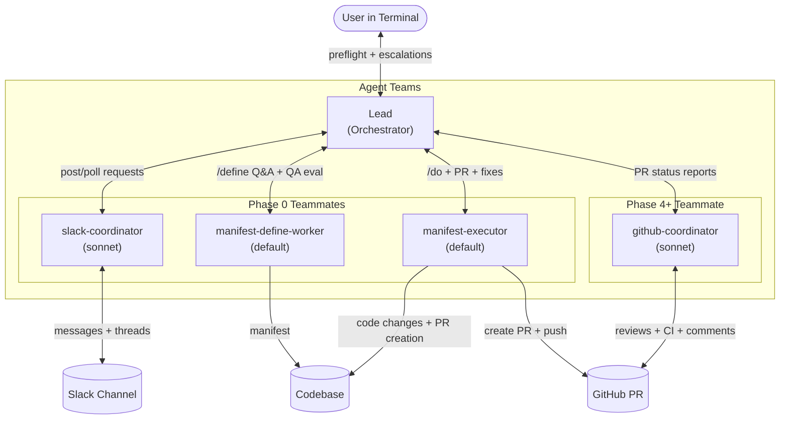
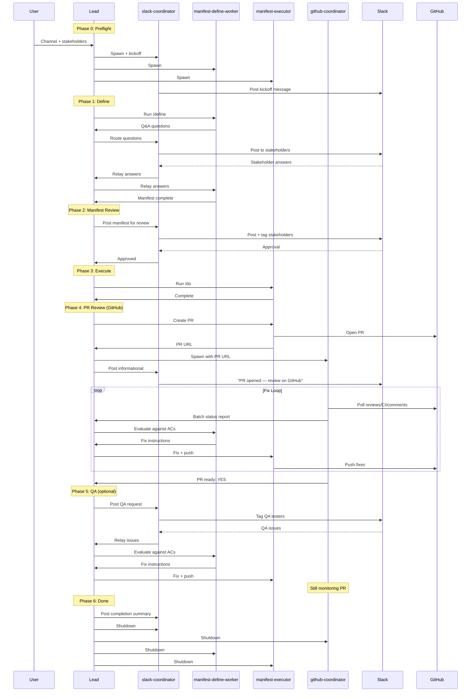

# manifest-dev-collab

Team collaboration on define/do workflows through Slack and GitHub.

## What It Does

`/slack-collab` orchestrates a full define → do → PR → review → QA → done workflow with your team. The skill itself acts as the lead orchestrator using Claude Code's Agent Teams — spawning specialized teammates that coordinate via hub-and-spoke messaging through the lead.

**Team composition:**

| Teammate | Model | Role | Spawned |
|----------|-------|------|---------|
| **slack-coordinator** | sonnet | ALL Slack I/O. Lean diff polling (60s, `last_seen_ts`), reaction monitoring, main channel monitoring. Pronoun disambiguation. State file recovery on compaction. Prompt injection defense. | Phase 0 |
| **manifest-define-worker** | default | Runs `/define` with TEAM_CONTEXT. Persists as manifest authority — evaluates PR review comments (Phase 4) and QA issues (Phase 5). Can amend the manifest during PR review. | Phase 0 |
| **manifest-executor** | default | Runs `/do` with TEAM_CONTEXT. Code implementation only. Creates PR. Rejects out-of-scope tasks (e2e, deploy, logs). | Phase 0 |
| *ad-hoc teammates* | varies | Lead spawns on-the-fly for tasks that don't fit existing roles (e.g., e2e-runner, deploy-monitor). | As needed |
| **github-coordinator** | sonnet | ALL GitHub PR I/O. Lean diff polling, bot vs human comment labeling, full PR state reporting. State file recovery on compaction. | Phase 4 |

The lead is the **autonomous orchestrator** — it processes coordinator reports immediately, decides what actions to take, and instructs teammates to execute. Teammates are pollers and doers, not decision-makers. The lead sends intent and context to coordinators (not verbatim messages). The owner is the unblocker and final authority.

**Key capabilities:**
- **Dynamic team composition** — lead spawns ad-hoc teammates on-the-fly for tasks that don't fit existing roles
- **Phase-anchored threading** — each phase gets one Slack anchor, updates go under it (define questions are the exception)
- **Verification hard gate** — Phase 4 is gated on verification passing; lead MUST act on verification requests
- **Idle suppression** — coordinators only message the lead when there IS activity; no idle heartbeats
- **Intent-based delegation** — lead sends intent, coordinators compose the actual messages
- **Review-fix loop automation** — findings → classify → fix → re-review, driven autonomously by the lead
- **Strict role boundaries** — manifest-executor is code-only; out-of-scope tasks get rejected

**Communication model:** Hub-and-spoke — all teammates communicate only with the lead. The lead routes to the slack-coordinator for Slack interaction and to the github-coordinator for GitHub PR monitoring.

## Prerequisites

- **Slack channel** created by the user with stakeholders already invited. The workflow does not create channels or invite users.
- **Slack MCP server** configured with: send_message, read_channel, read_thread, search_channels, search_users, read_user_profile.
- **GitHub access** via `gh` CLI (authenticated) or GitHub MCP server. Used for PR review monitoring in Phase 4+.
- **manifest-dev plugin** installed (provides `/define`, `/do`, `/verify`).
- **`CLAUDE_CODE_EXPERIMENTAL_AGENT_TEAMS=1`** environment variable set.

## Usage

```
/slack-collab add rate limiting to the API
```

**Optional flags** (forwarded to downstream skills):
- `--interview <level>` — forwarded to `/define` (controls interview depth: `minimal | autonomous | thorough`)
- `--mode <level>` — forwarded to `/do` (controls verification intensity: `efficient | balanced | thorough`)

```
/slack-collab --interview minimal --mode efficient add rate limiting to the API
```

Flags are stored in the state file and persist across `--resume`. Flags provided alongside `--resume` override stored values.

The skill runs through 7 phases:

1. **Preflight** — Lead asks for existing Slack channel ID + stakeholders (names, handles, roles), then creates the team
2. **Define** — define-worker runs `/define`, messages lead for Q&A (lead routes to slack-coordinator → Slack)
3. **Manifest Review** — slack-coordinator posts manifest to Slack, polls for approval
4. **Execute** — manifest-executor runs `/do`, messages lead for escalations
5. **PR Review** — manifest-executor creates PR, github-coordinator monitors (bot/human labeled). Fix loop: github-coordinator → lead → manifest-define-worker evaluates (can amend manifest) → executor fixes. Bot comments: fix or resolve, no discussion. Human comments: comment and wait for approval. CI triage: base-branch comparison, empty commit for transient failures.
6. **QA** (optional) — Human QA via Slack + github-coordinator still monitors PR. Both fix loops operate in parallel.
7. **Done** — slack-coordinator posts completion summary, all teammates shut down

## Architecture





## How It Works

The lead coordinates teammates via Agent Teams mailbox messaging (hub-and-spoke). Skills (`/define`, `/do`) receive a `TEAM_CONTEXT` block that tells them to message the lead — skills don't know about Slack. The lead routes stakeholder questions to the coordinator, which handles all Slack interactions: posting in topic-based threads, lean diff polling (60s intervals, `last_seen_ts` tracking, reaction monitoring, 24h timeout before owner escalation), and relaying answers back through the lead. Coordinators recover seamlessly from context compaction via state file.

Workers needing subagent capabilities (manifest-verifier, verification agents) request launches from the lead via a structured subagent request. The lead spawns them and results are delivered directly to the requesting worker (or via file-based handoff as fallback).

- Questions and escalations → worker → lead → coordinator → Slack threads
- Verification → worker → lead spawns subagent → subagent → worker
- All logs and artifacts → local files only
- Role separation prevents file conflicts
- State file is lead-owned (single writer) — coordinator sends thread updates to lead

## Resuming

If a session crashes or is interrupted:

```
/slack-collab --resume /tmp/collab-state-<id>.json
```

Reads the state file to determine the current phase and re-creates the team. Supports mid-phase resume for polling states — if the process was waiting for a Slack response, it resumes polling.

## Known Limitations

- **Agent Teams is experimental.** The `CLAUDE_CODE_EXPERIMENTAL_AGENT_TEAMS` env var indicates experimental status.
- **Subagent SendMessage may not work.** If subagents can't use SendMessage to teammates, results are delivered via file-based handoff (subagent writes to /tmp, lead tells worker the path).
- **No automated E2E tests.** Full integration testing requires Agent Teams + Slack environment.
- **/tmp files may not persist across system restarts.** Resume requires the state file and referenced artifacts to exist.

## Security

Both coordinators are the single points of contact for external input. The slack-coordinator treats all Slack messages as untrusted; the github-coordinator treats all PR comments and review bodies as untrusted. Neither exposes secrets, runs arbitrary commands, or accepts dangerous requests — suspicious content is flagged to the owner. Other teammates (manifest-define-worker, manifest-executor) never touch Slack or GitHub directly — all communication goes through the lead.
